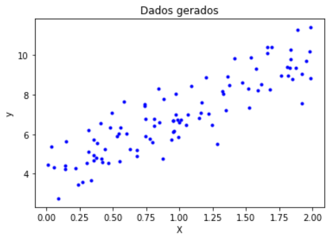
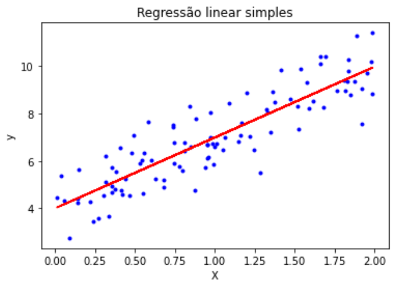

# Descrição do repositório

Este repositório armazena um notebook sobre Regressão Linear (simples e múltipla), contendo um estudo sobre esse tema desenvolvido no âmbito do grupo CiDAMO, com a orientação do Profº Lucas Pedroso. O notebook contém:

```
1 Introdução
  1.1 O problema de regressão
  1.2 Exemplos
  1.3 Tipos de regressão
2 Entendimento da regressão linear
  2.1 Formalização do problema de regressão linear
  2.2 Exemplo de aplicação em dados gerados
3 Regressão linear em um dataset
  3.1 Treinamento
  3.2 Teste e avaliação
```

# Ilustração da regressão linear

Apenas a título de ilustração, considere o seguinte conjunto de pontos:



O que a regressão linear faz (no caso simples), é encontrar a reta que melhor se ajusta no conjunto de pontos, ou seja:



Essa reta será usada para prever novos valores de *y* quando as variáveis preditoras *X* não forem conhecidas. Note que, nesse exemplo, temos apenas uma variável preditora *X*, então trata-se de uma regressão linear simples. Porém, podemos ter várias variáveis preditoras, caracterizando uma regressão linear múltipla.

Veremos esses dois casos de regressão, com uma aplicação para cada um no notebook deste repositório, bem como a explicação técnica do funcionamento da regressão linear.
